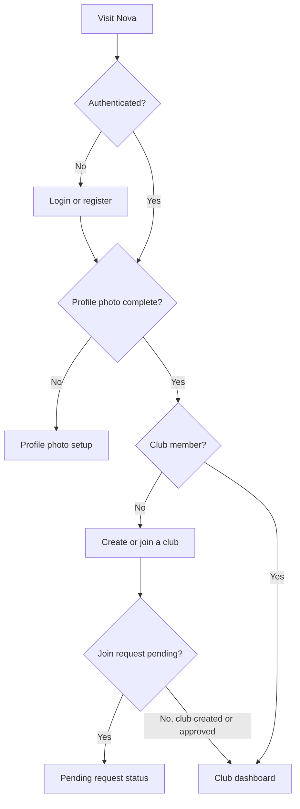

# Nova MVP Product Workflows

## Purpose

This document describes the current application state and a proposed MVP for club roster management, tryout campaigns, qualitative player evaluation, team placement, and campaign closeout.

## Product Decisions

- Primary users are club administrators and evaluators/coaches.
- Every approved club member may evaluate in the MVP. A separate evaluator role or campaign staff assignment is deferred.
- A season contains campaigns. An administrator chooses an existing season or creates one inline while creating a campaign.
- Teams are persistent club records. Every active team is available in every active campaign.
- Players are persistent club records. Every active player is enrolled when a campaign is created.
- A player added later is automatically enrolled in every active campaign.
- Team eligibility is a hard rule: `Player.GraduationYear >= Team.GraduationYear`.
- Evaluation is qualitative: shared notes and shared position/trait tags, not numeric scoring.
- Notes and tag applications are explicitly associated with a player's campaign participation.
- A note can be edited or deleted only by its author or a club administrator.
- A player can have a given tag once per campaign. The applying user or a club administrator can remove it.
- Campaigns have two product states: Active and Closed. Closed campaigns are read-only and can be reopened by an administrator.
- Before close, every participant must have one final outcome: Assigned, Not selected, or Withdrawn.
- Campaign decisions are visible only to approved club members in the MVP.
- Players, teams, and tag definitions can be archived and restored while remaining available to history. Archived players are excluded from automatic enrollment.

## Current State

### Implemented

- ASP.NET Identity registration, login, logout, and account management.
- Required profile-photo onboarding and profile-photo management.
- Club creation and club search.
- Club join requests with pending, approved, rejected, and cancellation flows.
- Club membership and club administrator authorization.
- Club detail and club administration pages.
- Club-based EF Core tenancy, audit stamping, and tenant-safe read/write contexts.
- Active/Archived lifecycle with provenance for players, teams, and tag definitions.
- Active/Closed campaign lifecycle with closure metadata and append-only close/reopen events.
- Campaign participation outcomes, tryout-number uniqueness, placement integrity, and optimistic concurrency.
- Assignment-scoped evaluation notes and explicit campaign tag applications with author/admin mutation rules.
- Transactional lifecycle/write guards, incremental migrations, and focused SQLite/PostgreSQL coverage.
- Feature-local functional cores for campaign closure, placement lifecycle/eligibility, and account-deletion classification, with effectful authorization, locking, persistence, and logging retained in service shells.

### Not Yet Implemented as Product Workflows

- A useful authenticated home dashboard.
- Player roster management and player archive/restore.
- Team management.
- Season and campaign management.
- Campaign participant enrollment.
- Evaluation notes and campaign tag applications.
- Team placement and closeout outcomes.
- Campaign close, read-only history, and reopen.

## Roles and Permissions

| Capability | Club administrator | Evaluator/coach |
| --- | --- | --- |
| View dashboard, roster, teams, and campaigns | Yes | Yes |
| Create/edit/archive players | Yes | No |
| Create/edit/archive teams | Yes | No |
| Create/close/reopen campaigns | Yes | No |
| Add notes and tags in an active campaign | Yes | Yes |
| Edit/delete a note | Yes | Only when they authored it |
| Remove a tag | Yes | Only when they applied it |
| Place players and set closeout outcomes | Yes | No for MVP |
| View closed campaign results | Yes | Yes |
| Manage club members and administrators | Yes | No |

An evaluator is initially a club member with evaluation permissions. A dedicated evaluator role or campaign-level staff assignment can be added later if regular club members should not automatically evaluate. The evaluator endpoint policy is only a coarse access gate; evaluation domain services must also validate current club membership and tenant ownership before reading or writing club data.

## Entry and Navigation



Primary navigation for a club member:

- Home
- Campaigns
- Players
- Teams
- Club
- Account

Administrator-only commands appear within the relevant area rather than in a separate administration application.

## Screen Map

| Screen | Route concept | Purpose |
| --- | --- | --- |
| Club onboarding | Existing `/Clubs/Onboarding` | Create a club, search to join, or view a pending request. |
| Club dashboard | `/` | Show active work, useful counts, and role-appropriate next actions. |
| Campaign list | `/campaigns` | Browse active and closed campaigns by season. |
| Create campaign | `/campaigns/new` | Choose/create a season and define campaign name and dates. |
| Campaign workspace | `/campaigns/{id}` | Evaluate participants, place players, and close the campaign. |
| Player roster | `/players` | Search/filter active and archived club players. |
| Player detail | `/players/{id}` | Edit profile and view history grouped by campaign. |
| Team list | `/teams` | Manage persistent active and archived teams. |
| Team detail | `/teams/{id}` | Edit team rules and view current/historical placements. |
| Club detail/admin | Existing club routes | Membership, join requests, and administrator management. |

## Screen Designs

### 1. Club Dashboard

The dashboard is the post-login home for a user who belongs to a club. It should answer: What is active, what needs attention, and where should I go next?

```text
+----------------------------------------------------------------------------+
| Club name                                      [Search] [Account]           |
+----------------------------------------------------------------------------+
| HOME | CAMPAIGNS | PLAYERS | TEAMS | CLUB                                  |
+----------------------------------------------------------------------------+
| Active campaigns                                                          |
| Tryouts Summer 2026       84 players   19 undecided   [Open workspace]      |
| Fall Goalkeeper ID        22 players    5 undecided   [Open workspace]      |
+----------------------------------------------------------------------------+
| Roster                    | Teams                   | Admin attention       |
| 126 active players        | 8 active teams          | 3 join requests       |
| 4 archived                | 1 archived              | 19 decisions remain   |
| [View players]            | [View teams]            | [Review]              |
+----------------------------------------------------------------------------+
| Recent activity: notes, tags, placements, campaign close/reopen events      |
+----------------------------------------------------------------------------+
```

- Evaluators see active campaigns and recent evaluation activity.
- Administrators additionally see setup gaps, pending join requests, and unresolved closeout counts.
- When no campaign exists, administrators see a primary Create campaign action. Evaluators see a neutral empty state.

### 2. Player Roster

```text
+----------------------------------------------------------------------------+
| Players                                   [Active v]        [+ Add player]  |
| [Search name or tryout number] [Grad year v] [Tag v]                      |
+----------------------------------------------------------------------------+
| Name              Grad year   Tags                 Active campaigns        |
| Avery Johnson     2032        Defender, Fast       Summer Tryouts          |
| Sam Rivera        2031        Keeper               Summer Tryouts, Fall ID |
| ...                                                                        |
+----------------------------------------------------------------------------+
```

- Administrators manually create and edit players.
- Required MVP fields: first name, last name, date of birth, and graduation year.
- Tryout number belongs to campaign participation, not the permanent player profile.
- Archive replaces destructive deletion for a player with history.
- Adding an active player automatically creates participation in every active campaign.

### 3. Player Detail and History

```text
+----------------------------------------------------------------------------+
| Avery Johnson                                      [Edit] [Archive]         |
| DOB: ...   Graduation: 2032   Current traits: Defender, Fast               |
+----------------------------------------------------------------------------+
| Campaign history                                                            |
| v Tryouts Summer 2026    Outcome: Assigned - U12                           |
|   Tags: Defender, Fast                                                    x |
|   Jun 12, Pat: Strong recovery run and communication.                      |
|   Jun 10, Morgan: Comfortable receiving under pressure.                    |
| > Spring Assessment 2026  Outcome: Not selected                            |
+----------------------------------------------------------------------------+
```

- The history is queried through explicit campaign participation, not inferred from date ranges.
- Each note shows author and timestamp from the existing audit fields.
- Tags shown as current within a campaign have an application timestamp and applying user.

### 4. Teams

```text
+----------------------------------------------------------------------------+
| Teams                                            [Active v] [+ Add team]    |
+----------------------------------------------------------------------------+
| Team       Graduation cutoff   Current placement count   Status            |
| U12        2032                14                        Active             |
| U13        2031                16                        Active             |
+----------------------------------------------------------------------------+
```

- A team persists across seasons and campaigns.
- Archiving excludes a team from future and active campaign placement options without erasing history.
- Editing a graduation cutoff must identify any existing active placements that would become invalid and block the edit until resolved.

### 5. Create Campaign

```text
+----------------------------------------------------------------------------+
| Create campaign                                                             |
| Season       [2026 v] [Create season]                                       |
| Name         [Tryouts Summer 2026________________________]                   |
| Start date   [06/01/2026]     Planned end date [06/30/2026]                |
|                                                                            |
| Enrollment preview                                                         |
| 126 active players will be enrolled. 8 active teams will be available.     |
|                                                     [Cancel] [Create]       |
+----------------------------------------------------------------------------+
```

- Creation immediately makes the campaign Active; there is no Draft state in the MVP.
- Enrollment is a transactional snapshot of all active players.
- Active teams are discovered dynamically for placement; a campaign-team join is unnecessary for the MVP.
- Planned end date does not close the campaign automatically.

### 6. Campaign Workspace

```text
+----------------------------------------------------------------------------+
| Tryouts Summer 2026                       ACTIVE          [Campaign menu]    |
| Overview | Evaluate | Placements | Closeout                                   |
+----------------------------------------------------------------------------+
| [Search] [Grad year v] [Tag v] [Outcome v] [Team v]     84 participants    |
+------------------------------------------+---------------------------------+
| PLAYER ROSTER                            | PLAYER DRAWER                   |
| Avery Johnson   2032  Defender           | Avery Johnson        [<] [>]   |
| Sam Rivera      2031  Keeper             | Grad 2032 / Tryout #47          |
| Jordan Lee      2033  --                 |                                 |
| ...                                      | Tags                            |
|                                          | [Defender x] [+ Add tag]        |
|                                          |                                 |
|                                          | Notes                           |
|                                          | [Add observation...] [Save]     |
|                                          | Jun 12 Pat: Strong recovery...  |
+------------------------------------------+---------------------------------+
```

- The filterable roster and player drawer are the primary evaluator workflow.
- Next/previous keeps the current filter and sort order.
- Approved club members can add notes and tags only while the campaign is Active.
- Note edit/delete commands are shown only to the author and club administrators.
- A tag removal command is shown only to its applying user and club administrators.
- Applications using an archived tag definition remain visible but cannot be removed.
- The layout becomes a full-screen player detail panel on narrow screens; the roster state is preserved on return.

### 7. Placements

```text
+----------------------------------------------------------------------------+
| Placements                 [Grad year v] [Unresolved only x]                |
+----------------------------------------------------------------------------+
| Player           Grad    Outcome         Team                               |
| Avery Johnson    2032    [Assigned v]    [U12 - cutoff 2032 v]             |
| Sam Rivera       2031    [Not selected]  --                                 |
| Jordan Lee       2033    [Undecided v]   --                                 |
+----------------------------------------------------------------------------+
| 65 assigned | 11 not selected | 2 withdrawn | 6 undecided                  |
+----------------------------------------------------------------------------+
```

Placement invariants:

- Assigned requires a `TeamId`.
- Not selected and Withdrawn require `TeamId` to be null.
- Undecided is allowed only while the campaign is Active.
- A player is eligible only when `Player.GraduationYear >= Team.GraduationYear`.
- `CampaignPlacementService` validates shared input rules before database access, loads and locks fresh tenant facts, delegates lifecycle/eligibility decisions to `CampaignPlacementPolicy`, and applies accepted mutations in the same transaction.

### 8. Closeout

```text
+----------------------------------------------------------------------------+
| Close campaign: Tryouts Summer 2026                                        |
+----------------------------------------------------------------------------+
| Readiness                                                                  |
| [x] 84 participants enrolled                                               |
| [x] 78 final outcomes                                                      |
| [!] 6 players still undecided                         [Review unresolved]   |
|                                                                            |
| Closing freezes notes, tags, outcomes, and placements.                     |
|                                                     [Cancel] [Close]        |
+----------------------------------------------------------------------------+
```

- Close is blocked while any participant is Undecided or any Assigned participant lacks an active, eligible team.
- `CampaignLifecycleService` projects fresh assignment facts after acquiring the campaign mutation lock, delegates readiness to `CampaignClosurePolicy`, and applies closure effects only when the policy returns `CampaignMayClose`.
- Closing records `ClosedAt`, FK-less `ClosedById`, and an append-only lifecycle event.
- Closed workspace tabs remain readable and export-ready.
- Reopen is administrator-only, records an audit event, and restores editing without discarding outcomes.

## Core Workflows

### Club Setup

1. A new user registers and completes the existing profile-photo requirement.
2. The user creates a club or searches for and requests to join one.
3. A club creator becomes a club administrator and lands on the dashboard.
4. A joining user sees pending status until an administrator approves the request.
5. The administrator adds active teams and active players.

### Campaign Creation

1. Administrator starts Create campaign.
2. Administrator chooses a season or creates one inline.
3. Administrator enters campaign name, start date, and planned end date.
4. Nova previews active player and active team counts.
5. In one transaction, Nova creates the Active campaign and one participation record for every active player.
6. The campaign appears on the club dashboard and is immediately available to evaluators.

### Player Evaluation

1. An approved club member opens an active campaign from the dashboard.
2. The member filters the roster by name, graduation year, tag, outcome, or team.
3. The member opens a player's drawer.
4. The member adds a timestamped note or applies a club-defined tag.
5. The member moves to the next player without losing roster context.
6. All approved club members see the shared evaluation stream.

### Placement

1. Administrator opens Placements and filters unresolved players.
2. Administrator chooses Assigned, Not selected, or Withdrawn.
3. Assigned prompts for an active eligible team.
4. Nova hard-blocks an ineligible team assignment.
5. Summary counts update so the administrator can track closeout readiness.

### Campaign Close and Reopen

1. Administrator opens Closeout.
2. Nova validates that no participant is Undecided and all Assigned participants have active, eligible teams.
3. Administrator closes the campaign.
4. Nova records closure time and freezes evaluation and placement writes.
5. Approved club members can browse campaign results and player history.
6. An administrator can deliberately reopen the campaign, with the action recorded for audit.

## Implemented Domain and EF Core Foundation

Epic #6 established `PlayerCampaignAssignmentEntity` as campaign participation and the parent for evaluation records.

### Player

- Uses the shared Active/Archived lifecycle with `ArchivedAt` and FK-less `ArchivedById`.
- Keep permanent identity/demographic fields on the player.
- Campaign-varying tryout number lives on campaign participation.
- Block a graduation-year edit that would invalidate an active placement until the placement is resolved.
- Require explicit resolution of active campaign participation before archiving a player; do not silently rewrite campaign outcomes.

### Team

- Uses the shared Active/Archived lifecycle with `ArchivedAt` and FK-less `ArchivedById`.
- Keep `GraduationYear` as the minimum eligible graduation year.
- Block archive or cutoff changes that would invalidate an active placement until affected placements are resolved.
- Preserve archived teams as valid references in historical campaign results.

### Campaign

- Uses explicit `CampaignStatus` with Active and Closed values.
- Stores `ClosedAt` and FK-less `ClosedById`.
- Treat the existing end date as a planned date, not as the source of completion state.
- `IsComplete` is status-based.
- Allow administrators to correct Active campaign metadata without repeating roster enrollment.
- Require reopening before editing a Closed campaign.
- Close and reopen transitions append tenant-owned lifecycle events so repeated transitions remain auditable.

### Campaign Participation

`PlayerCampaignAssignmentEntity` includes:

- `TryoutNumber`.
- `PlacementOutcome`: Undecided, Assigned, NotSelected, Withdrawn.
- Existing nullable `TeamId`.
- A unique index on `(CampaignId, PlayerId)` to prevent duplicate enrollment.
- A unique filtered index on `(CampaignId, TryoutNumber)` when the tryout number is not null.
- An application-managed `Guid` concurrency token for placement mutations.
- An index supporting campaign roster filters, with additional indexes added only after query shapes are implemented and measured.

Do not add a separate `IsActive` flag to participation. Campaign status and placement outcome already express its lifecycle.

### Evaluation Notes

Notes now have a required `PlayerCampaignAssignmentId`; the ambiguous player-only relationship was removed.

- The assignment provides the player, campaign, and club context.
- `BaseEntity.CreatedAt` and `CreatedById` provide timestamp and authorship.
- Keep audit user IDs FK-less, consistent with the existing Nova model.
- Only the author or a club administrator may edit or delete a note while the campaign is Active.
- Cascade notes when participation is deleted. In normal product workflows, campaigns and players should be archived/closed rather than deleted once history exists.

### Tag Definitions and Applications

`PlayerTagEntity` remains the club-owned definition for name and color. The implicit player/tag many-to-many join was replaced with an explicit campaign tag application entity containing:

- `PlayerCampaignAssignmentId`.
- `PlayerTagId`.
- `ClubId` for tenancy.
- `BaseEntity` audit fields identifying who applied the tag and when.
- A unique index on `(PlayerCampaignAssignmentId, PlayerTagId)`.

Tag definitions have an Active/Archived lifecycle. Archived definitions remain visible in history, cannot be applied, and protect existing applications from removal. Tag-definition management is administrator-only.

Removal authorization is enforced in the service: the applying user's `CreatedById` must match the caller, unless the caller is a club administrator. Physical deletion is sufficient for the MVP's shared-current-trait semantics; append-only tag history is explicitly out of scope.

### Tenancy and Integrity

- Every new club-scoped entity implements `ITenantOwnedEntity` and has a real `ClubId` relationship.
- Composite foreign keys enforce same-club relationships for lifecycle events and tag applications; participation and note services repeat tenant-consistency checks.
- Continue using `NovaDbContext` for tenant writes and `NovaReadDbContext` for read-only roster/history queries.
- Tenant isolation and cross-tenant write coverage exists for each new entity.
- Validate related player, campaign, team, tag, and assignment records belong to the current club.
- Enforce graduation-year eligibility through the placement service shell and its pure policy in the same transaction. A PostgreSQL `CHECK` constraint cannot compare values from the related Player and Team rows.
- Campaign participation uses optimistic concurrency, and lifecycle-sensitive writes use transaction-scoped mutation locks so close/archive operations cannot race dependent writes.

### Functional Core and Imperative Shell

- Use feature-local deterministic policies for non-trivial business-rule matrices, not for simple guards or database-native queries.
- Services remain the imperative shells responsible for validation, authorization, tenant-safe EF queries, transaction-scoped locks, fresh-state reloads, optimistic concurrency, persistence, logging, and effect execution.
- Policies receive compact immutable facts and return domain-named outcomes. Consume those outcomes exhaustively with `Match` or `Switch`, not positional `IsTn`/`AsTn` checks.
- Use source-generated named OneOf unions for reused or multi-case public/service contracts when the domain name improves signatures; keep small single-use policy unions native.
- Test policies directly without EF, DI, or mocks; retain SQLite service-shell tests and PostgreSQL provider, constraint, lock, and race tests.
- Canonical implementations are `CampaignClosurePolicy`, `CampaignPlacementPolicy`, and `AccountDeletionPolicy`. Follow `.github/instructions/functional-core.instructions.md` and the `extract-functional-core` skill for future extractions.

### Migration Outcome

- There was no durable production data, so ambiguous player-only notes and the implicit player/tag join were removed rather than assigned to campaigns without evidence.
- Existing players, teams, and tag definitions default to Active; existing campaigns default to Active rather than deriving closure from `EndDate`.
- Each schema-bearing child added an incremental migration through `NovaDbContext`, preserving the migration chain.
- Clean PostgreSQL migration coverage and `has-pending-model-changes` verification confirmed the final model.

## MVP Epics

- **Epic 1: Authenticated entry and club dashboard**
  - Replace the placeholder home page with the role-aware club dashboard.
  - Preserve profile-photo and create/join club onboarding gates.
  - Add primary navigation for Campaigns, Players, Teams, Club, and Account.
  - Show active campaigns, unresolved decisions, roster/team counts, join requests, and role-appropriate empty states.

- **Epic 2: Domain model and persistence foundation — complete**
  - Added Active/Archived lifecycle to players, teams, and tag definitions.
  - Added explicit Active/Closed campaign status, closure metadata, and append-only lifecycle events.
  - Extended campaign participation with tryout number, placement outcome, integrity constraints, and optimistic concurrency.
  - Replaced player-only evaluation relationships with assignment-scoped notes and explicit tag applications.
  - Added reusable evaluator authorization plus transactional lifecycle and placement guards.
  - Added shared placement input validation, deterministic closure/placement/account-deletion policies, exhaustive OneOf handling, and named multi-case service results.
  - Added and verified incremental migrations, tenancy/integrity tests, and PostgreSQL migration/race coverage.

- **Epic 3: Player roster management**
  - Add player list, search, graduation-year filtering, and active/archive views.
  - Add manual create and edit workflows with validation.
  - Add archive and restore while preserving campaign history.
  - Auto-enroll a newly created active player into all active campaigns transactionally.
  - Add player detail with campaign-grouped notes, tags, outcomes, and team history.
  - Keep enrollment/edit/archive orchestration in services; extract only non-trivial active-placement impact classification into feature-local pure policies over freshly loaded facts.

- **Epic 4: Persistent team management**
  - Add team list and detail screens.
  - Add create/edit validation for name and graduation-year cutoff.
  - Add archive/restore; expose only active teams for new placements.
  - Block cutoff edits that would invalidate active campaign placements until those placements are resolved.
  - Evaluate cutoff/archive placement impacts with compact fresh facts and a feature-local policy when the rule matrix becomes non-trivial; retain locks and persistence in the team service shell.

- **Epic 5: Seasons and campaign creation**
  - Add campaign list grouped by season and status.
  - Add inline season selection/creation.
  - Add campaign creation with name, dates, and enrollment preview.
  - Create campaign participation for all active players in one transaction.
  - Make all active teams available dynamically for placement.
  - Surface new active campaigns on the dashboard.

- **Epic 6: Campaign evaluation workspace**
  - Build the filterable participant roster and responsive player drawer.
  - Add filters for name, graduation year, tag, outcome, and team.
  - Add shared campaign notes with author and timestamp.
  - Add club tag definition management and campaign tag application.
  - Enforce note mutation by author/administrator and tag removal by applying user/administrator.
  - Disable all evaluation writes for closed campaigns.

- **Epic 7: Team placement and closeout outcomes**
  - Add placement table and unresolved-player workflow.
  - Support Undecided, Assigned, Not selected, and Withdrawn states while active.
  - Require a team for Assigned and clear the team for other final outcomes.
  - Hard-block assignments where player graduation year is below the team's cutoff.
  - Handle concurrent placement edits with a clear conflict-and-refresh experience.
  - Show outcome and team summary counts.
  - Reuse `UpdateCampaignPlacementInput`, `CampaignPlacementService`, `CampaignPlacementPolicy`, and `PlacementUpdateResult`; endpoints and UI must not duplicate or invoke policy rules directly.

- **Epic 8: Campaign close, history, and reopen**
  - Add closeout readiness validation and unresolved-player drill-down.
  - Block close while any outcome is Undecided or any placement is invalid.
  - Freeze notes, tags, outcomes, and placements on close.
  - Keep closed campaign workspaces and player histories readable by club staff.
  - Add administrator-only reopen with an auditable event.
  - Reuse `CampaignLifecycleService`, `CampaignClosurePolicy`, and `CampaignCloseResult`; closeout UI presents policy blockers but does not recalculate readiness rules.

- **Epic 9: MVP hardening and usability**
  - Add authorization tests for administrator and evaluator boundaries.
  - Add tenant-isolation tests for every campaign workflow.
  - Add responsive and keyboard-accessible roster, drawer, forms, and placement controls.
  - Add loading, empty, validation, conflict, and retry states.
  - Add focused integration tests for create campaign, late player enrollment, evaluation, placement, close, and reopen.
  - Add database-free matrix coverage for every new deterministic policy, representative SQLite shell coverage, and PostgreSQL coverage for provider, lock, concurrency, and race behavior.
  - Add basic campaign roster and final placement CSV export only after the core closeout workflow is stable.

## Reviewed Implementation Order

1. **Domain model and persistence foundation** (`#6`) is the hard prerequisite for all new product workflows.
2. **Player roster management** (`#7`) establishes the active roster and late-player enrollment behavior.
3. **Persistent team management** (`#8`) establishes eligible placement targets. This can overlap with player roster work after the foundation is complete.
4. **Seasons and campaign creation** (`#9`) depends on active players and teams and creates campaign participation.
5. **Campaign evaluation workspace** (`#10`) depends on campaign creation and the campaign-scoped evaluation model.
6. **Team placement and closeout outcomes** (`#11`) depends on teams, campaigns, outcome state, and concurrency handling. It can overlap with evaluation after campaign creation.
7. **Campaign close, history, and reopen** (`#12`) depends on evaluation write guards and valid final placement outcomes.
8. **Authenticated entry and club dashboard** (`#5`) is completed after campaign and placement queries exist. The navigation shell may be implemented earlier.
9. **MVP hardening and usability** (`#13`) is completed last, although tests, accessibility, failure states, and observability are developed continuously within each earlier epic.

## Explicitly Deferred Beyond MVP

- Player/parent self-registration and outcome portal.
- CSV player import.
- Numeric ratings or configurable evaluation rubrics.
- Evaluator-specific votes on tags.
- Append-only tag add/remove history.
- Campaign-specific team customization.
- Invitations, notifications, and email delivery.
- Public result publication.
- Automated season closeout.
- Advanced reporting and analytics.
